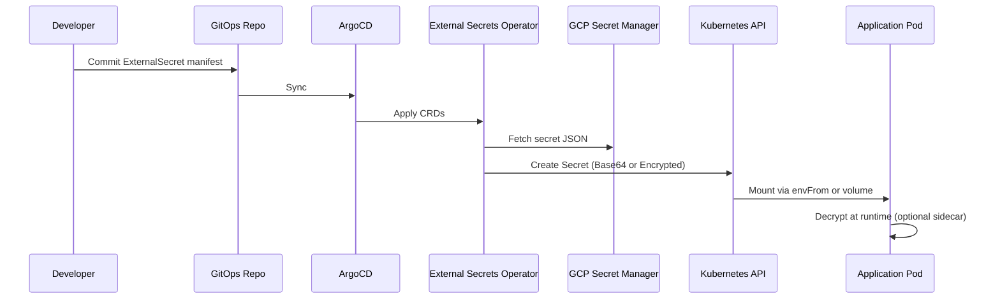

# End-to-End Secret Encryption Lifecycle

This document explains the complete **Secret Encryption Lifecycle** across all layers of a Kubernetes-based architecture, from storage in the cloud provider to runtime consumption by the application.

---

## 🧩 Lifecycle Overview

---

## 🔒 Layers of Encryption

| Layer | Mechanism | Description |
|-------|------------|-------------|
| **1. Provider Encryption** | CMEK or Envelope Encryption | Secrets are encrypted with KMS-managed keys at rest. |
| **2. Transport Encryption** | HTTPS / TLS | Secrets are transmitted over encrypted channels (API → ESO → K8s). |
| **3. Kubernetes Encryption** | Encryption at Rest (etcd) | K8s uses a KMS plugin to encrypt Secret objects stored in etcd. |
| **4. Runtime Encryption** | Application Decryption | Apps can decrypt secrets via sidecars or KMS client SDKs. |

---

## 🧠 Practical Example

1. Secret stored in **GCP Secret Manager**, encrypted with a **CMEK** key.  
2. ESO fetches and creates a **Kubernetes Secret**, using a **KMS plugin** to encrypt etcd.  
3. App container reads the secret as an environment variable or file.  
4. Optional sidecar decrypts it dynamically using KMS or Vault Transit API.  

---

## 🧰 Recommendations

- Use **different KMS keys per environment (dev/stage/prod)**.  
- Rotate keys periodically and log all decryption operations.  
- Enable **Kubernetes encryption at rest** via `EncryptionConfiguration`.  
- Combine ESO + Reloader for automated secret sync and rollout.  

---

**Next:** [Zero Trust Secret Flow →](zero-trust-flow.md)
