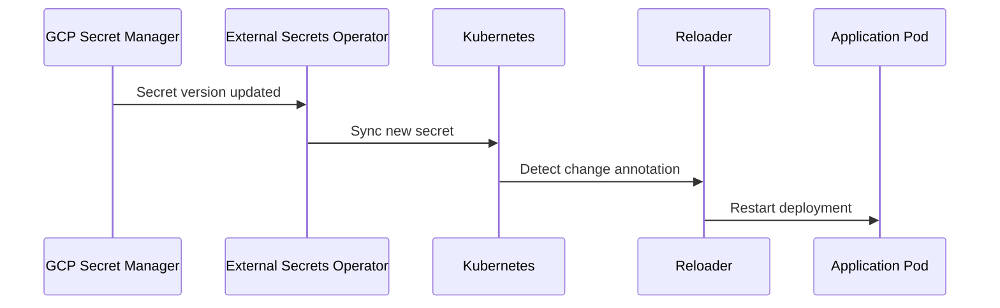

# Secret Rotation Strategies

A good secret management strategy must include **automatic or controlled rotation mechanisms** to prevent credential reuse and minimize exposure time.

---

## 🧭 Rotation Types

| Type | Description | Tools / Example |
|------|--------------|-----------------|
| **Manual Rotation** | Human-triggered, usually via CI/CD pipelines. | `sops --rotate`, `kubectl apply` |
| **Event-Driven Rotation** | Triggered by an external event (e.g., DB password rotated). | ESO + Secret Manager webhook |
| **Scheduled Rotation** | Time-based rotations at fixed intervals. | Cloud Secret Manager + ESO sync |
| **Dynamic Rotation** | Secrets rotate automatically via operators. | Vault Dynamic Secrets, CSI driver |

---

## 🧩 Example: ESO + Reloader

---

## 🧠 Best Practices

- Define rotation frequency per secret type (e.g., DB = 30d, API = 90d).  
- Avoid shared credentials; prefer unique per-service access.  
- Combine with audit trails and compliance alerts.  

---

**Next:** [RBAC and IAM Integration →](rbac-iam.md)
